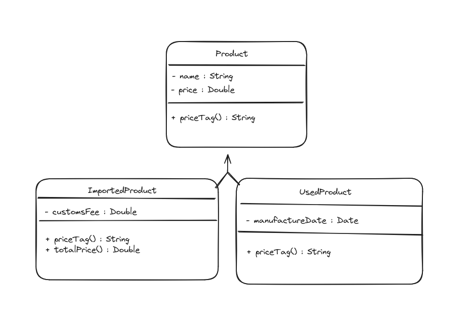

Fazer um programa para ler os dados de N produtos (N fornecidos pelo usuário). Ao final, mostrar a etiqueta de preço de cada produto na mesma ordem em que foram digitados.

Todo produto possui nome e preço. Produtos importados possuem uma taxa de alfândega, e produtos usados possuem data de fabricação. Esses dados específicos devem ser acrescentados na etiqueta de preços conforme exemplo. Para produtos importados, a taxa de alfândega deve ser adicionada ao preço final do produto.

